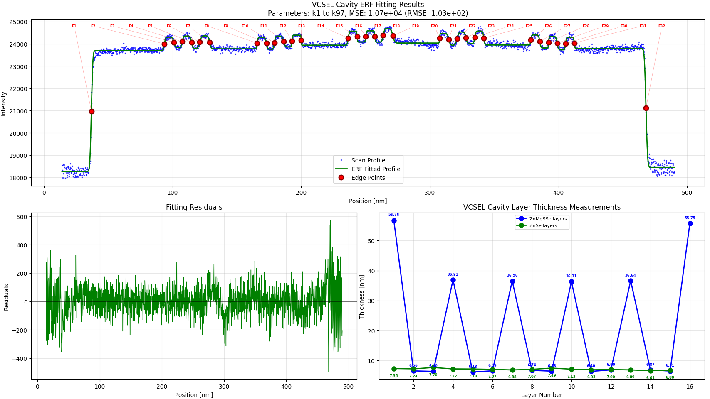

# ERF-VCSEL-Analyzer

> A desktop tool that fits a sum-of-error-function (ERF) model to STEM intensity
> linescans of VCSEL cavities to extract individual epitaxial layer thicknesses.

## Overview

Vertical-cavity surface-emitting lasers (VCSELs) are built from many thin
epitaxial layers. In a STEM image, each interface appears as a smooth intensity
step. **ERF-VCSEL-Analyzer** models a linescan as a baseline plus a sum of error
functions — one per interface — and fits it with high precision to recover the
position of every edge and, from consecutive edges, each layer thickness with an
uncertainty estimate.

## Features

- **DM3 loading** with a HyperSpy-first, ncempy-fallback reader (pixel size in nm).
- **Interactive linescan** selection directly on the image.
- **High-precision fitting** — Levenberg–Marquardt (default) or bounded
  trust-region-reflective (positive ERF widths).
- **Per-layer thicknesses** with covariance-based (or residual-based) error bars.
- **Custom material names** and configurable ERF parameters (`k1, k2, …, kN`).
- **One-click export** of results (JSON/CSV/TXT) to the loaded DM3's folder.

## Screenshots & Examples

A full step-by-step walkthrough with result screenshots lives in
[`examples/`](examples/README.md).



## Installation

Requires Python 3.8+. On Windows (PowerShell):

```powershell
python -m venv .venv
.venv\Scripts\Activate.ps1
python -m pip install -r requirements.txt
```

Core dependencies are `numpy`, `scipy`, and `matplotlib`. Reading `.dm3` files
requires at least one of `hyperspy` or `ncempy` (both listed in
`requirements.txt`).

## Usage

Run all commands from the repository root so that `import vcsel_analyzer`
resolves correctly.

```bash
python erf_vcsel_analyzer_combined.py
```

Typical workflow: **Load DM3 → draw linescan → Extract Profile → Set Parameters
→ Fit ERF → Show Results → Export Data**. See [`examples/`](examples/README.md)
for annotated screenshots of each step.

## Project structure

| Path | Responsibility |
|---|---|
| `erf_vcsel_analyzer_combined.py` | Tkinter/Matplotlib GUI entry point |
| `vcsel_analyzer/core/` | Pure numerics: ERF model, fitting, thickness, units |
| `vcsel_analyzer/io/` | DM3 loading and parameter text I/O |
| `vcsel_analyzer/export/` | Report generation |
| `vcsel_analyzer/config.py` | `ERF_CONFIG` tolerances and defaults |
| `tests/` | Pytest suite mirroring the package modules |
| `docs/` | Technical notes |
| `examples/` | End-to-end walkthrough and screenshots |

## The ERF model

A linescan is modeled as

```
y(x) = k1 + Σ amplitude_i · erf(width_i · (x − position_i))
```

where each triplet `(amplitude, width, position)` encodes one interface and the
positions `k4, k7, k10, …` are the layer edges.

## Documentation

- [**Choosing good initial ERF parameters**](docs/initial-parameters-guide.md) —
  how to read a physically meaningful initial guess (baseline, amplitude sign and
  size, width, position) directly off a linescan profile, what the tool estimates
  automatically, and why one parameter set can be reused across linescans.
- [**ERF inflection-point analysis**](docs/erf_inflection_point_analysis.md) — a
  rigorous derivation of when the ERF centers `k4, k7, k10, …` can be treated as
  layer edges (inflection points), including the exponential error bound and the
  practical separation criterion.

## Testing

Activate the virtual environment first (`pytest` is installed from
`requirements.txt`). Running tests in a shell where the environment is not
active raises `No module named pytest`.

```powershell
.venv\Scripts\Activate.ps1
python -m pip install -r requirements.txt
python -m pytest
```

## Contributing

Development conventions and architecture notes are in
[`AGENTS.md`](AGENTS.md) and [`CLAUDE.md`](CLAUDE.md).

## License

Released under the [MIT License](LICENSE) © 2026 Qian Gang.
