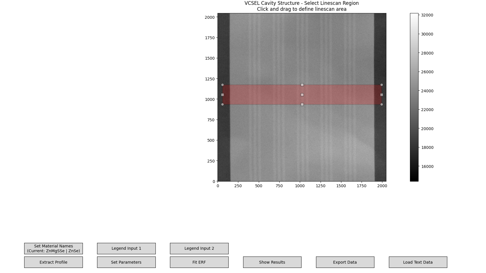
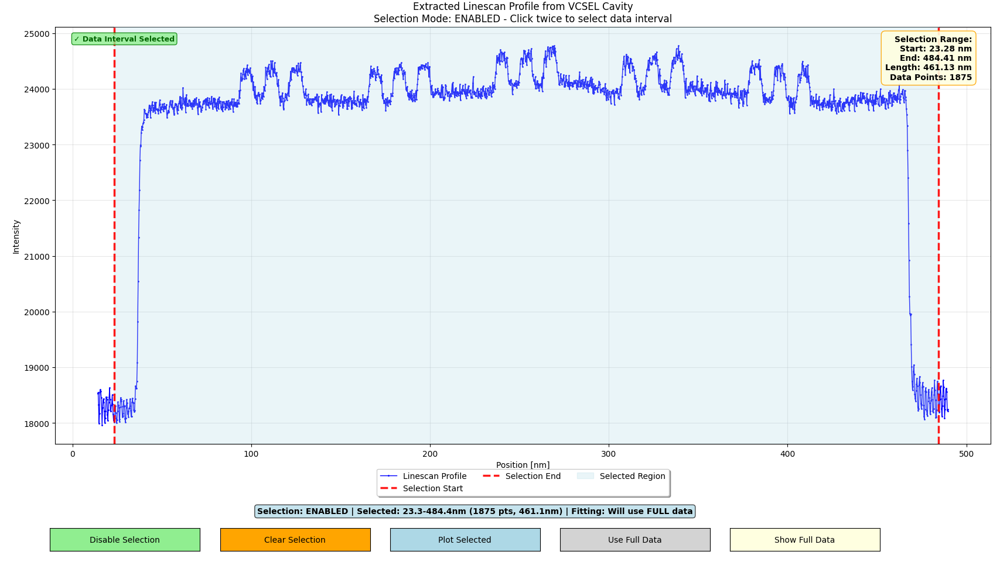
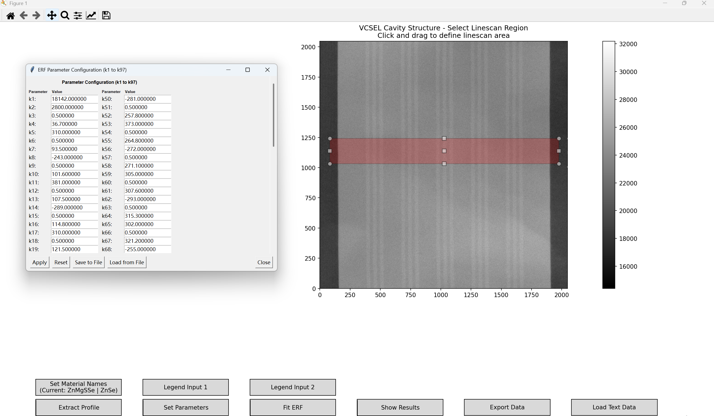
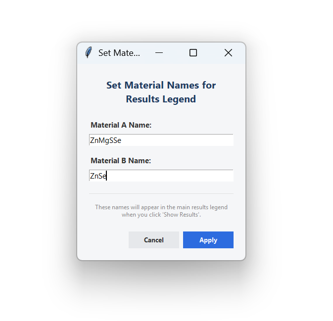
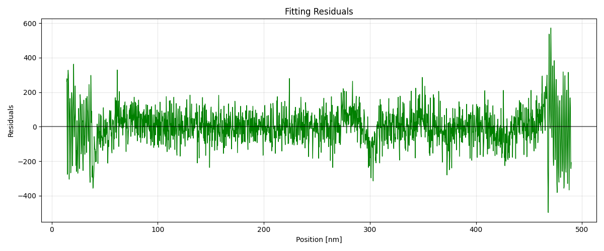
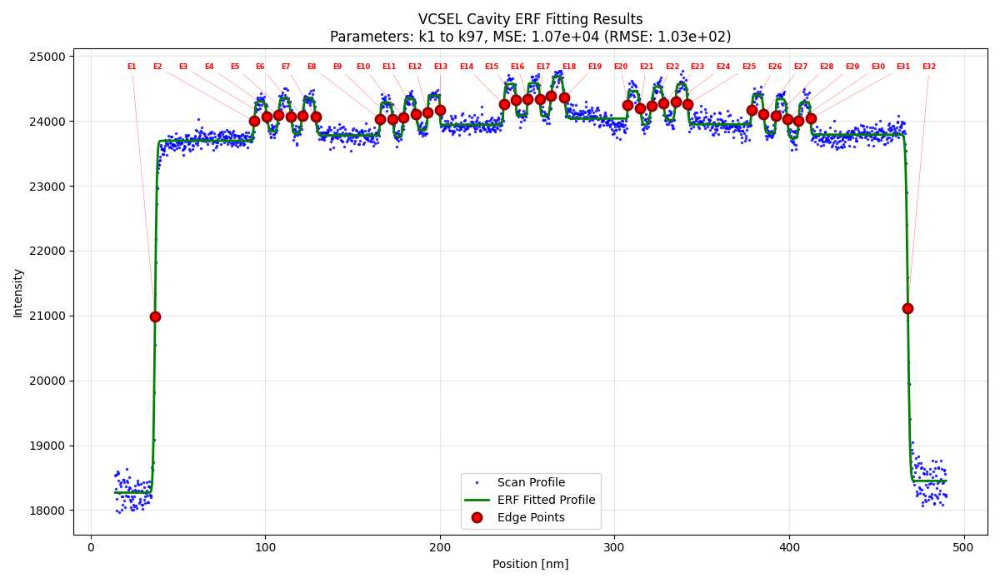
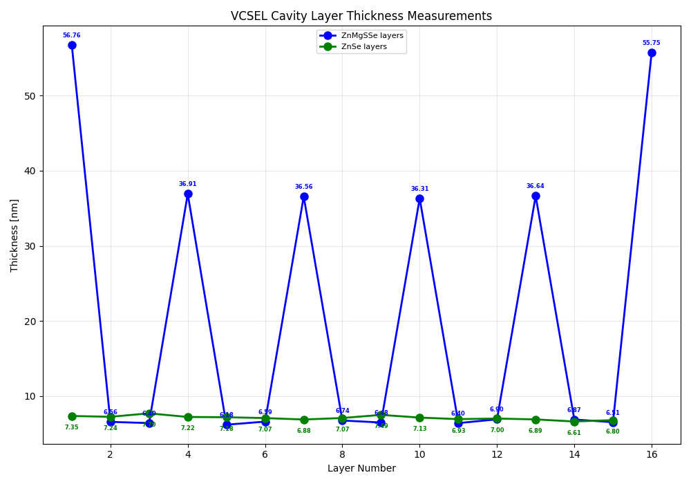
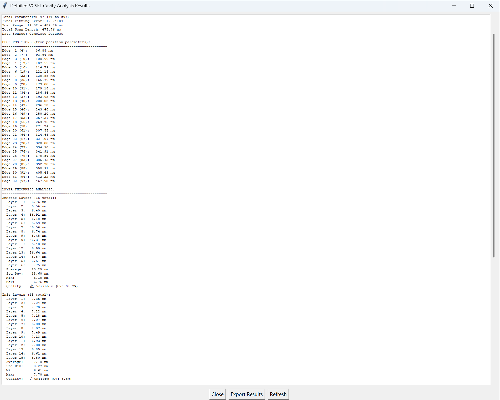

# Examples

An end-to-end walkthrough of **ERF-VCSEL-Analyzer**, with result screenshots.

## Contents

- `vcsel_cavity_initial_parameters.txt` — sample ERF parameters you can load
  from the parameter window (**Set Parameters → Load from File**).
- `*.png` — screenshots for each step below.

> Note: a STEM `.dm3` image is required as input. Use your own cavity scan
> (sample `.dm3` files are not distributed with this repository).

## Workflow

Launch the analyzer from the repository root:

```bash
python erf_vcsel_analyzer_combined.py
```

### 1. Draw a linescan

Load a DM3 image, then click and drag a rectangle across the layers.



### 2. Extract the profile

Average the selected region into a 1-D intensity linescan.



### 3. Set the ERF parameters

Choose the number of ERF components, or load
`vcsel_cavity_initial_parameters.txt`.



### 4. Name the materials (optional)

Set custom material names shown in the results legend.



### 5. Fit the ERF model

Run the high-precision fit and inspect the fitted curve.


### 6. Check the residuals

Verify the fit quality from the residual plot.



### 7. Inspect the edge points

The ERF centers (`k4, k7, k10, …`) mark the layer edges.



### 8. Read the layer thicknesses

Per-layer thicknesses are derived from consecutive edges.



### 9. Export the results

Save JSON/CSV/TXT results to the DM3's folder.


